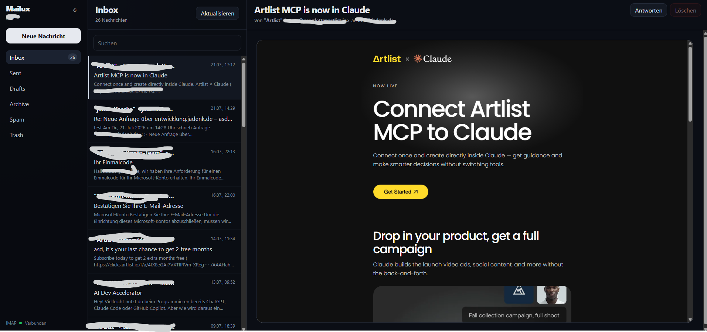

<div align="center">

# Mailux

**A self-hosted webmail UI and admin panel for your own Postfix + Dovecot mail server.**

[](https://github.com/JadnK/Mailux/actions/workflows/ci.yml)
[](https://github.com/JadnK/Mailux/actions/workflows/codeql.yml)




</div>

## What it is

Mailux turns a plain Postfix + Dovecot mail server into something you can
actually manage from a browser: a dark, indigo-accented three-pane inbox
with all your real IMAP folders, attachments, CC/BCC, and - for any
account with sudo rights - creating and removing mailboxes, all without
ever touching SSH.

Mailboxes **are** Linux system accounts. There's no separate user database:
Mailux authenticates against PAM, reads `/etc/passwd` to find accounts with
a Maildir, and reads/sends mail straight over IMAP/SMTP as that user. It's
deliberately simple, at the cost of needing root to run (see
[`docs/SECURITY.md`](docs/SECURITY.md) for why, and what that means for how
it's deployed).

## Features

- **Real folders** - Inbox, Sent, Drafts, Archive, Spam and Trash are read
  straight from IMAP, auto-created on first visit if an account (or a
  particular folder) predates Mailux, instead of permanently showing
  "folder doesn't exist"
- **Custom folders + move/right-click actions** - create your own IMAP
  folders from the sidebar, drag a message onto any folder to move it, or
  right-click a message for a context menu (move, mark read/unread,
  delete)
- **Per-account forwarding + autoresponder** - optionally forward incoming
  mail to another address and/or send an automatic out-of-office reply,
  both from "Einstellungen". Implemented server-side as a Dovecot Sieve
  script (`~/.dovecot.sieve`), so it fires immediately on delivery - even
  if nobody's logged into the web UI - and mail always stays in the
  account too, it's never a pure redirect
- **Storage usage** - "Einstellungen" shows how much of the mailbox's
  quota is currently used, with a warning color as it fills up
- **Mail templates / quick replies** - save reusable text snippets and
  insert one into a message with a click from the compose toolbar
- **Star important mail** - flag a message from the list, the reader, or
  the right-click menu (backed by the IMAP `\Flagged` flag), and filter
  the list down to starred-only
- **Attachments** - drag-and-drop or pick files onto a new message, and
  download attachments straight from a received mail
- **Compose & reply** - Gmail-style inline reply under the open message
  (not a modal that hides it), a rich text editor (bold/italic/underline/
  strikethrough/lists) for the mail body, and every new draft is seeded
  with your signature, editable right there in the body
- **Delete = move to Trash** - available to every logged-in user for their
  own mail (not just root); deleting from Trash itself is permanent, same
  as any other mail client
- **Profile settings** - every user can set their own display name and
  signature under "Einstellungen" - none of it requires root
- **Unread tracking** - the inbox badge shows the unread count (not the
  total), unread messages are bolded with a dot in the list, opening one
  marks it read via IMAP, and a header toggle filters the list down to
  unread-only
- **Keyboard shortcuts** - `c` starts a new message, `/` jumps to search,
  `Escape` closes the compose window
- **Admin rights follow sudo, not the `root` username** - any account in
  the server's `sudo`/`wheel` group gets a "Verwaltung" section inside the
  normal mail client for user management (creating, deleting and
  granting/revoking admin rights) and site-wide settings. Unlike the old
  root-only model, an admin account is still a completely normal, usable
  mailbox - granting someone admin rights doesn't take their inbox away.
  Membership is checked live against `/etc/group` on every request, so
  revoking sudo takes effect immediately. Nobody can remove their own
  admin rights or delete their own account
- **Session-based auth** - PAM login issues a short opaque session token;
  your mail password never sits in browser storage in plaintext (see
  [`docs/SECURITY.md`](docs/SECURITY.md))
- **systemd-native deployment** - no Docker required; one `install.sh` sets
  up both services

## Tech stack

| | |
| --- | --- |
| Backend | Node.js, Express, TypeScript, `authenticate-pam`, `imap-simple`, `nodemailer` |
| Frontend | React 19, TypeScript, Vite |
| Auth | PAM (system accounts) + server-side session store |
| Deployment | systemd (see [`deploy/`](deploy)), no containers required |

## Quickstart (development)

Requires Node.js 20+ and, to build `authenticate-pam` from source, PAM
headers (`libpam0g-dev` on Debian/Ubuntu).

```bash
git clone https://github.com/JadnK/Mailux.git
cd Mailux

# Backend
cd backend
cp .env.example .env   # set MAIL_HOST, MAIL_HOST_IMAP, etc.
npm install
npm run dev             # http://localhost:5000

# Frontend (separate shell)
cd frontend
npm install
npm run dev              # http://localhost:5173
```

The backend needs root only for PAM login and the user-management
endpoints (`useradd`/`chpasswd`/`deluser`); reading/sending mail for an
existing account works without it during local development.

## Production deployment

Full guide, including the Postfix/Dovecot/DKIM setup if you're starting
from scratch: **[`docs/DEPLOYMENT.md`](docs/DEPLOYMENT.md)**.

Short version, once Postfix + Dovecot are running:

```bash
git clone https://github.com/JadnK/Mailux.git /opt/mailux-src
cd /opt/mailux-src
sudo ./deploy/install.sh
sudoedit /etc/mailux/backend.env
sudo systemctl enable --now mailux-backend mailux-frontend
```

This installs two systemd services (`deploy/systemd/`):

- **`mailux-backend`** - runs as `root` (required for PAM + user
  management), bound to `127.0.0.1:5000`
- **`mailux-frontend`** - static build served by [`serve`](https://github.com/vercel/serve),
  runs as an unprivileged `mailux-web` user, bound to `127.0.0.1:4173`

Put a reverse proxy (nginx, Caddy, **Nginx Proxy Manager**, ...) in front of
both, on one hostname, with the backend mounted under `/api` - the frontend
calls a relative `/api/...` path, so it only works when both are served
from the same origin. Step-by-step instructions for Nginx Proxy Manager,
plain nginx and Caddy are in
[Reverse proxy / HTTPS for the web UI](docs/DEPLOYMENT.md#reverse-proxy--https-for-the-web-ui).

No Docker is involved - Mailux needs direct access to `/etc/passwd`, PAM,
and system Maildirs, which containers make more awkward, not less.

## Project layout

```
backend/    Express API (TypeScript) - auth, mail, users, settings
frontend/   React + Vite web UI
deploy/     systemd units + install/uninstall scripts
docs/       Deployment guide, security model
```

## Documentation

- [`docs/DEPLOYMENT.md`](docs/DEPLOYMENT.md) - full server setup, from a bare
  Postfix/Dovecot install to a running Mailux behind a reverse proxy
- [`docs/SECURITY.md`](docs/SECURITY.md) - why the backend runs as root, how
  login sessions and privileged commands are handled, known limitations
- [`CONTRIBUTING.md`](CONTRIBUTING.md) - local dev setup and PR checklist

## Contributing

Bug reports and PRs are welcome - see [`CONTRIBUTING.md`](CONTRIBUTING.md).
CI (`.github/workflows/ci.yml`) lints, type-checks and builds both packages
on every PR.
